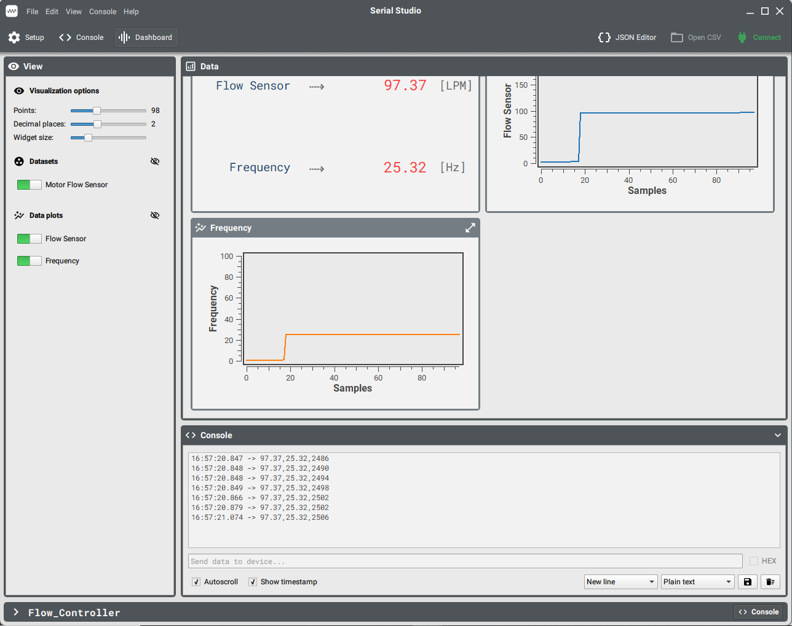
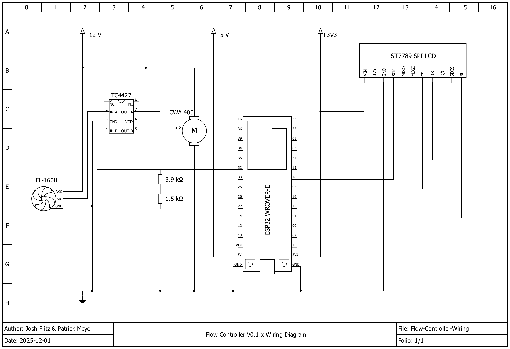

# Flow Channel Controller

This is the code used to control the motor and sensors attached to a flow channel for experimental monitoring. Currently it utilizes a limited set of instructions to control the pump speed, data writing and monitoring of an attached flow sensor. The developmnet of the system is part of an ongoing project into the effects of micro surfaces on fluid flow.  

The system controller, a ESP32 WROVER-E, is responsible for sending and receiving the instructions to operate the pump, display, and flow sensor.  
The pump is controlled by sending information to the controller via a usb UART (Universal Asynchronous Receiver/Transmitter) connection to a console on a computer.
Feedback from the controller is also sent over this connection to be displayed in the console.

This project is built using the Espressif IDF (VSCode Extention), more detailed information espressif and the IDF can be found in the Espressif [programming guide](https://docs.espressif.com/projects/esp-idf/en/stable/esp32/index.html)

## Overview

A limited set of commands was implemented to control base functionality of the pump:
- MODE was chosen for switching operation on and off    ("mode 0" for OFF, "mode 2" for ON)
- FLOW was chosen for setting the pump speed as a %     ("flow %" where % is an integer from 0-100)
- DATA was chosen for turning on/off write to file      ("data 0" no write, "data 1" for data write)

These commands when entered into the console of the connected computer and are sent to the controller  which are inturn parsed into the appropriate output from the controller.
The current state of the system is refected on a LCD display to allow for the ssytem state to remain always visable. System information is also sent to the console to allow for the data to be visuallized during operations ( with software such as [Serial Studio](https://github.com/Serial-Studio/Serial-Studio)).



### Project Components

This project uses the ESP LVGL port for displaying information on the LCD screen.

## Using the Flow Channel Controller

The project is designed such that it can be cloned and directly flashed to the controller. In order to build and flash the system the ESP-IDF must be installed, detailed information for installing the IDF and related tools can be found in the Espressif [Documentation](https://docs.espressif.com/projects/esp-idf/en/latest/esp32/get-started/index.html#build-your-first-project).

The system includes the following components in its implementation.
- ESP32 WROVER-E
- PWM controlled pump
- FL-1608 Flow sensor encoder
- ST7789 SPI LCD Screen
- TC4427 MOSFET Driver
- External computer (for monitoring and sending commands)



## The PWM Configuration for the Pump signal

The pump's PWM signal is created with the LEDC component of the ESP-IDF. This component is designed to modulate the brightness of LED's with a PWM signal, but the PWM creation can also be used for generating other PWM signals as long as the characteristics of the PWM signal is relatively straight forward. As the selected pump [Pierburg "CWA400" (PWM version)] can operates based on the duty cycle of the PWM signal and accepts a frequency from 50 - 1000 Hz, the pump can be controlled with a constant frequency and just varying the duty cycle.

The pump operation, based on the inputted duty cycle, is specified as follows;  
    [ 0 -   1%] -> Stop  
    [ 1 -   7%] -> Emergency running (95%)  
    [ 8 -  12%] -> Not implemented  
    [13 -  85%] -> Controlled operation from min to max speed  
    [86 -  97%] -> Max speed  
    [98 - 100%] -> Emergency running (95%)  

This requires that whatever the target speed (specified as a %) is it needs to be mapped onto a corresponding duty cycle from 13 to 85. The ESP LEDC component accepts duty cycles as an integer based on the set resolution of the PWM channel, resolution is set as the number of bits that the timer controlling the PWM uses to quantify the time steps. For example:
```
    Let the resolution (r) be 10 bits, the target speed (s) be 50%.
           (Speed to Duty %)     0.13+(s*0.72) = 0.13+(0.50.72) = 0.13+0.36 = 0.49 = 49%
    (Duty % to Duty Integer)     (duty %)*(2^r) = 0.49*(2^10) = 0.49*1024 = 501
     (Speed to Duty Integer)     (0.13+s*0.72)*(2^r)
```
When a command to change the speed of the pump is received, the now Duty integer is calculated and updated.

## The PWM Parsing of the Flow Meter signal

The flow meter PWM is generated by a hall effect encoder attached to a propeller inline with the flow from the pump. This allows for the frequency of the PWM signal to be applied to a formula to determine the flow rate of the system. The ESP has 2 method for determining the frequency of the encoder; counting the pulses that are observed across a given window of time or determining the recipricale of the time between each pulse. Both methods are susceptible to instantaneous changes, such as from signal noise spikes, so a buffer is used to calculate an averaged value from multiple data points.

Regardless of the method used for determining frequency, the ESP is programmed with an interrupt service routine (ISR) to response the edge of pulse generated by the flow sensor. A periodic task on the ESP will then take the conputed values and display them. The display is done at a rate independent of and much lower than the received PWM to conserve computing resources on the ESP.
